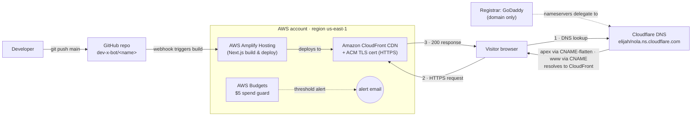

# Architecture — Next.js on AWS Amplify + Cloudflare DNS

High-level view of how these sites are built, served, and routed. Same pattern is reused for every site (see [`deploy-nextjs-amplify-cloudflare.md`](./deploy-nextjs-amplify-cloudflare.md)).

Live examples:
- `calibre` → https://calibrehrsolutions.ai (+ www)
- `synergy` → https://synergyglobalits.com (+ www)

---

## Diagram



If the Mermaid diagram doesn't render, here's the same flow in ASCII:

```
                         git push main
   ┌───────────┐  ───────────────────────────►  ┌──────────────────┐
   │ Developer │                                 │  GitHub repo     │
   └───────────┘                                 │  dev-x-bot/<name>│
                                                 └────────┬─────────┘
                                                          │ webhook (auto build)
                                                          ▼
   ┌──────────────────────── AWS (us-east-1) ─────────────────────────┐
   │   ┌────────────────────┐      deploys     ┌────────────────────┐ │
   │   │ Amplify Hosting    │ ───────────────► │ CloudFront CDN     │ │
   │   │ (Next.js build)    │                  │ + ACM TLS (HTTPS)  │ │
   │   └────────────────────┘                  └─────────┬──────────┘ │
   │   ┌────────────────────┐                            │            │
   │   │ AWS Budgets $5 ····│····► alert email           │            │
   │   └────────────────────┘                            │            │
   └─────────────────────────────────────────────────────┼───────────┘
                                                          ▲ (3) HTTPS 200
        registrar (GoDaddy)                               │
        nameservers delegate to                           │
                 │                                        │
                 ▼                                        │
   ┌───────────────────────────┐     (1) DNS lookup   ┌───┴──────────┐
   │ Cloudflare DNS            │ ◄─────────────────── │   Visitor    │
   │ elijah/nola.ns.cloudflare │  apex=CNAME-flatten  │   browser    │
   │                           │ ───────────────────► │              │
   └───────────────────────────┘   returns CloudFront └──────┬───────┘
                                                             │ (2) HTTPS request
                                                             └──► CloudFront
```

---

## Request flow (what happens when someone visits the site)

1. **DNS lookup** — browser asks for `yourdomain.com`. Cloudflare is authoritative (registrar's nameservers delegate to it). For the **apex** it uses **CNAME flattening** to return the CloudFront IPs; for **www** it's a normal CNAME → CloudFront.
2. **HTTPS request** — browser connects to **Amazon CloudFront**, which presents the **ACM TLS certificate** (free, auto-renewed) and routes to the Amplify app by host header. HTTP is 301-redirected to HTTPS.
3. **Response** — Amplify serves the pre-built Next.js output via CloudFront's edge cache.

## Deploy flow (what happens when you ship a change)

`git push` to `main` → GitHub webhook → **Amplify** pulls, runs `npm ci && npm run build`, and deploys the new version to CloudFront automatically. No manual steps.

---

## Components

| Layer | Service | Role | Cost |
|---|---|---|---|
| Source | **GitHub** (`dev-x-bot/<name>`) | Code + deploy trigger | Free |
| Build & host | **AWS Amplify Hosting** | Builds Next.js, deploys on every push | Free tier |
| CDN + TLS | **Amazon CloudFront + ACM** | Global edge delivery + HTTPS cert | Free (incl. cert) |
| DNS | **Cloudflare** (Free) | Authoritative DNS; apex CNAME-flattening; optional proxy/CDN | Free |
| Registrar | **GoDaddy** | Owns the domain; nameservers point to Cloudflare | Domain fee only |
| Guardrail | **AWS Budgets** | $5/mo spend alert by email | Free |

## Notes / decisions
- **Why Cloudflare for DNS?** The apex (bare domain) can't be a CNAME in normal DNS, and Amplify/CloudFront give a *hostname* (not a fixed IP). Cloudflare's **CNAME flattening** solves apex→Amplify cleanly; GoDaddy DNS can't. Registrar stays GoDaddy.
- **No database / backend.** These are static-rendered Next.js sites — no DynamoDB, IAM app-role, or API routes. Add those only if a site needs dynamic data.
- **DNS records are kept `DNS only` (grey cloud).** Optional: enable Cloudflare proxy (orange) + SSL `Full` for edge CDN and "Always Use HTTPS".
